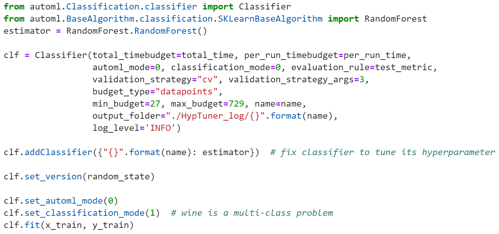
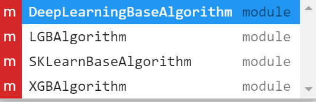

# Mode0超参调优特殊配置

**mode0模式是在模型固定时使用BOHB的超参调优方法（Hypertuner），该模式与其他模式不同点在于其需要传入指定的算法并实例化。**



算法模型需要从BaseAlgorithm下的算法库进行导入，BaseAlgorithm是本平台对所有算法进行的功能增强，使得通用算法在不更改其原始调用逻辑的情况下具备超参调优和模型评价等能力。目前本平台共有四大算法库，丰富的算法资源不但可以让用户在mode0下有更多的模型选择，也让平台在mode1和mode2下拥有更多优秀模型的选择空间。



**文末表格附有三大问题每个算法库包含的算法文件及其类名。**以用户想要指定XGBoost回归算法进行超参调优为例，该问题属于_**automl.BaseAlgorithm**_下的_**Regression**_回归问题，_**XGBAlgorithm**_是该算法库， 该库中包含_**xgb\_regressor**_算法文件，需要导入文件中的_**XGBRegressor**_类进行实例化。

```text
from automl.BaseAlgorithm.Regression.XGBAlgorithm.xgb_regressor import XGBRegressor
estimator = XGBRegressor()
```

由于本平台算法资源丰富、结构严密，所以不可避免地在调用时要通过多层级，以下是调用XGBoost算法的文件结构：




#### LGBAlgorithm算法库

| 文件名 | 类名 |
| :--- | :--- |
| lgb\_classifier | LGBClassifier |

#### XGBAlgorithm算法库

| 文件名 | 类名 |
| :--- | :--- |
| xgb\_classifier | XGBClassifier |

#### DeepLearningBaseAlgorithm算法库

| 文件名 | 类名 |
| :--- | :--- |
| GRU | GRU |
| LeNet | LeNet |
| LSTM | LSTM |
| ResNet | ResNet |

#### SKLearnBaseAlgorithm算法库

<table>
  <thead>
    <tr>
      <th style="text-align:left">&#x6587;&#x4EF6;&#x540D;</th>
      <th style="text-align:left">&#x7C7B;&#x540D;</th>
    </tr>
  </thead>
  <tbody>
    <tr>
      <td style="text-align:left">Adaboost</td>
      <td style="text-align:left">AdaBoostClassifier</td>
    </tr>
    <tr>
      <td style="text-align:left">DA</td>
      <td style="text-align:left">
        <p>LinearDiscriminantAnalysis</p>
        <p>QuadraticDiscriminantAnalysis</p>
      </td>
    </tr>
    <tr>
      <td style="text-align:left">ExtraTreesClassifier</td>
      <td style="text-align:left">ExtraTreesClassifier</td>
    </tr>
    <tr>
      <td style="text-align:left">GBDT</td>
      <td style="text-align:left">GBDT</td>
    </tr>
    <tr>
      <td style="text-align:left">GLM</td>
      <td style="text-align:left">GLM</td>
    </tr>
    <tr>
      <td style="text-align:left">GP</td>
      <td style="text-align:left">GPC</td>
    </tr>
    <tr>
      <td style="text-align:left">LogisticRegression</td>
      <td style="text-align:left">LogisticRegression</td>
    </tr>
    <tr>
      <td style="text-align:left">MLP</td>
      <td style="text-align:left">MLPClassifier</td>
    </tr>
    <tr>
      <td style="text-align:left">NB</td>
      <td style="text-align:left">
        <p>GaussianNB</p>
        <p>BernouliNB</p>
        <p>MultinomialNB</p>
      </td>
    </tr>
    <tr>
      <td style="text-align:left">NN</td>
      <td style="text-align:left">
        <p>KNeighborsClassifier</p>
        <p>RadiusNeighborsClassifier</p>
      </td>
    </tr>
    <tr>
      <td style="text-align:left">RandomForest</td>
      <td style="text-align:left">RandomForest</td>
    </tr>
    <tr>
      <td style="text-align:left">SGDClassifier</td>
      <td style="text-align:left">SGDClassifier</td>
    </tr>
    <tr>
      <td style="text-align:left">SVM</td>
      <td style="text-align:left">
        <p>SVC</p>
        <p>LinearSVC</p>
        <p>NuSVC</p>
      </td>
    </tr>
    <tr>
      <td style="text-align:left">Tree</td>
      <td style="text-align:left">DecisionTreeClassifier</td>
    </tr>
  </tbody>
</table>



| LGBAlgorithm |  |
| :--- | :--- |
| lgb\_regressor | LGBRegressor |

| XGBAlgorithm |  |
| :--- | :--- |
| xgb\_regressor | XGBRegressor |

| SKLearnBaseAlgorithm |  |
| :--- | :--- |
| Adaboost | AdaboostRegressor |
| ARDRegression | ARDRegression |
| ExtraTreesRegressor | ExtraTreesRegressor |
| GBDT | GBDT |
| GP | GPR |
| NN | KNeighborsRegressor |
| RandomForest | RandomForestRegressor |
| Ridge | Ridge |
| SGDRegressor | SGDRegressor |
| SVR | SVR |
| Tree | DecisionTreeRegressor |



| SKLearnBaseAlgorithm |  |
| :--- | :--- |
| AffinityPropagation | AffinityPropagation |
| AgglomerativeClustering | AgglomerativeClustering |
| Birch | Birch |
| DBSCAN | DBSCAN |
| DummyCluster | DummyCluster |
| GaussianMixture | GaussianMixture |
| KMeans | KMeans |
| MeanShift | MeanShift |
| MiniBatchKMeans | MiniBatchKMeans |
| SpectralClustering | SpectralClustering |




