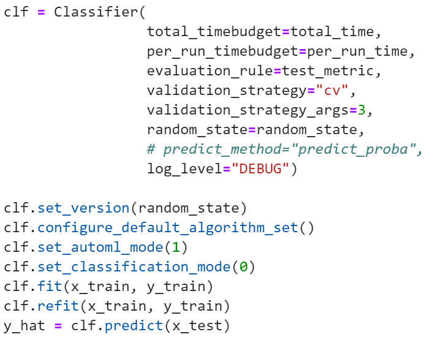

# Mode1模型超参特殊配置

**mode1是在不固定模型和参数的情况下进行模型选择和超参调优**，该模式采用了本平台团队自研的自适应连续过滤算法（BOASF，Bayesian Optimization and Adaptive Successive Filtering），能够结合模型情况更加合理的分配运算资源，让用户在给定时间内得到表现更加优秀的模型和参数选择结果。

**和mode0不同，mode1不需要指定算法进行传入，并且mode1会再多调用一步refit**，这是因为mode2在fit的时候对测试集又进行了划分测试集和验证集，所以fit后得到的模型需要再进行refit对整体测试集进行评价。

