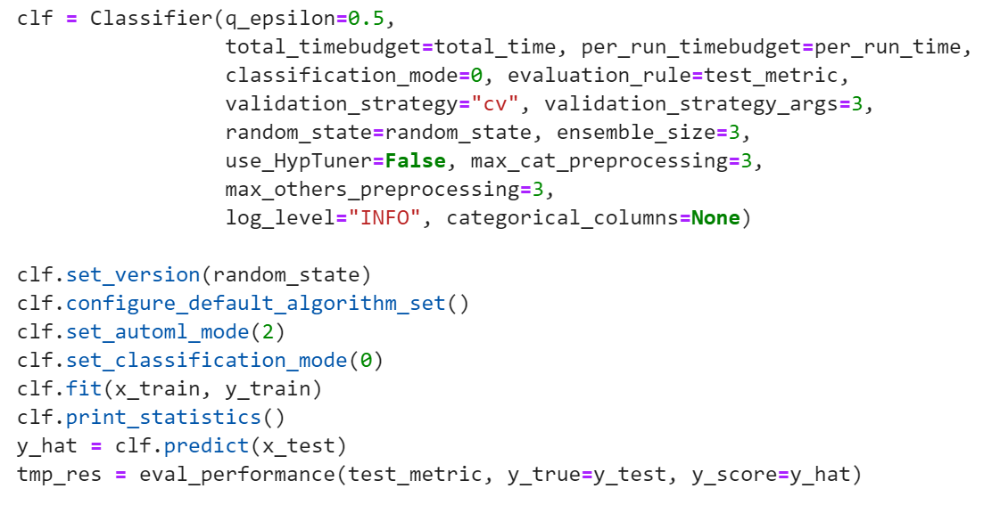
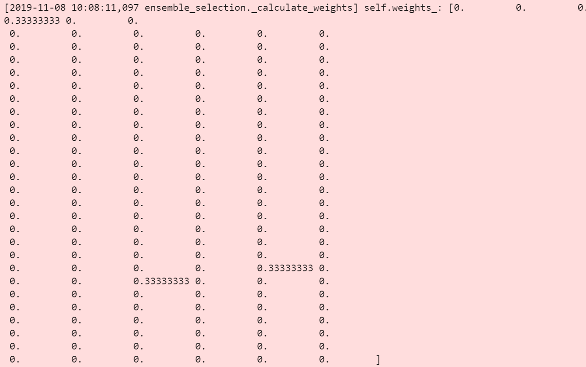

# Mode2 + 集成学习特殊配置

经过mode2的强化学习阶段，我们得到多个完成训练的机器学习模型，如果只单独选择在验证集上表现最好的一个模型作为最终模型，不仅会有过拟合的风险，同时也浪费了其它已经完成训练的模型。所以系统通过集成学习进一步提升模型效果。**mode2下使用集成学习的调用和mode2类似，除了将初始化的ensembel\_size设置大于1之外，还在predcit进行了配置。**

在集成学习模式中日志还会输出每个模型的weights，这里是3个模型，故只有3个位置有值：

